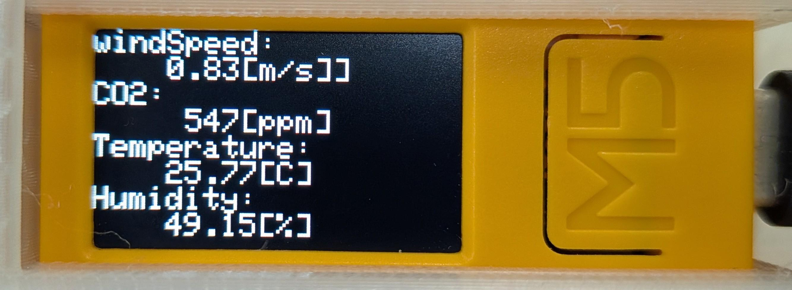

# M5StickCPlus2-ENV-BLE

## OverView
M5StickCPlus2で環境センサと風速計の測定値を取得し、BLEで送信を行います。  
UML図は[UML.md](UML.md)を参照してください。

## Requirements
- M5StickPlus2
- 環境センサ: CO2 Unit (SCD40)
- デジタル風速計: GM816
- Arduino IDE
- Python3
    - bleak 1.1.1

## Usage
1. ArduinoIDEでこのレポジトリを開く
2. 環境センサと風速計をM5StickCPlus2に接続する
3. M5StickCPlus2をPCに接続する
4. ArduinoIDEを用いてM5StickCPlus2に書き込む

## Features
### BLE通信
環境センサと風速計から得られる以下の計測値をBLEで送信します。  

- 風速値[m/s] (float)
- CO2濃度[ppm] (int)
- 温度[℃] (float)
- 湿度[%] (float)

小数値の送信は100倍して整数値にした後、受信側で1/100倍することで小数点第2位までの精度を送受信しています。

### 割り込み処理
常に風速値を測定するため、信号の立ち上がり時に割り込み処理を実行しています。  

### 風速計再起動
風速計GM816は、起動から14分で電源が落ちてしまうため、10分間隔で風速計を再起動するようにしています。  

## Reference
- [Arduino日本語リファレンス](http://www.musashinodenpa.com/arduino/ref/)
- [cpprefjp - C++日本語リファレンス](https://cpprefjp.github.io/index.html)
- [M5StickC非公式日本語リファレンス](https://lang-ship.com/reference/unofficial/M5StickC/)
- [M5StickCとラズパイ４とのBLE（Bluetooth Low Energy）通信を試してみた。](https://www.souichi.club/m5stack/m5stickc-ble/)

