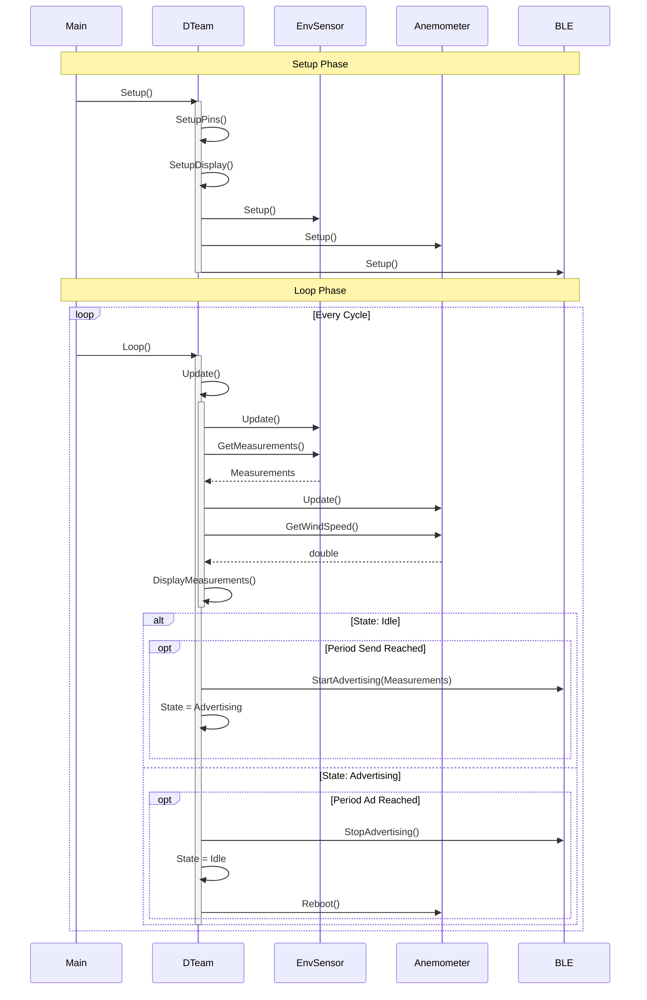
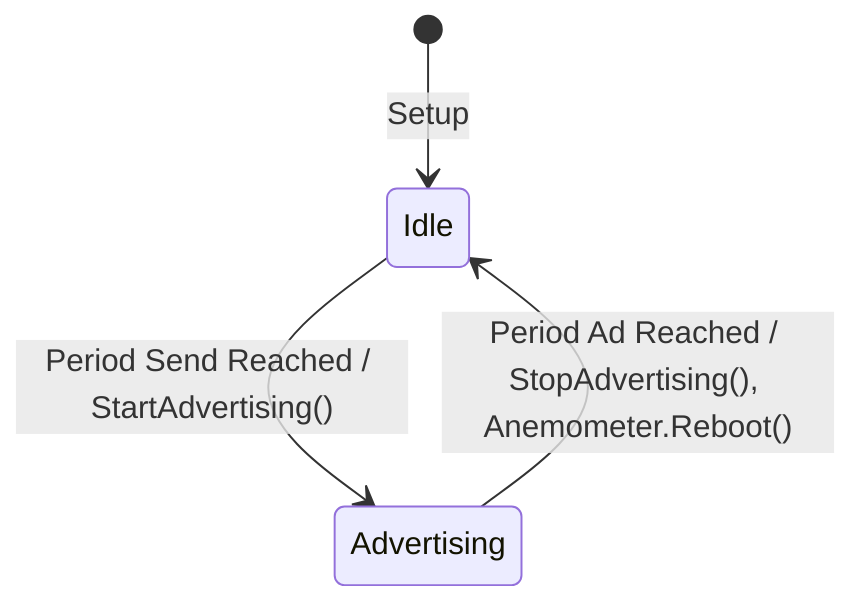
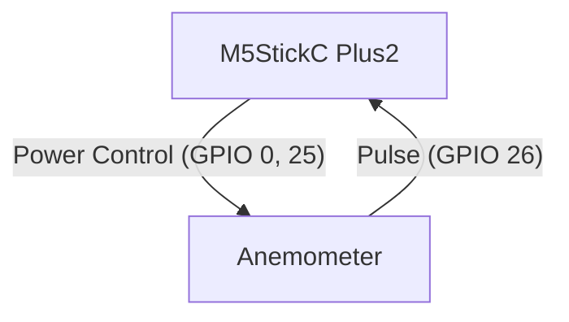

# UML

## Class Diagram

```mermaid
classDiagram
  DTeam *-- Anemometer
  DTeam *-- BLE
  DTeam *-- EnvSensor
  DTeam *-- Measurements
  EnvSensor ..> Measurements
  BLE ..> Measurements

  class DTeam {
    - EnvSensor m_envSensor
    - Anemometer m_anemometer
    - BLE m_ble
    - Measurements m_measurements
    - unsigned long m_preSendTimeMiliSec
    - State m_state
    - unsigned long m_stateStartTime
    + Setup() void
    + Loop() void
    - Update() void
    - SetupPins() void
    - SetupDisplay() void
    - DisplayMeasurements() void
  }

  class Anemometer {
    - double m_windSpeed
    - unsigned long m_preBootTimeMiliSec
    + Setup() void
    + Reboot() void
    + Update() void
    + GetWindSpeed() double
    - PowerOn() void
    - PowerOff() void
    - CalcWindSpeed(double) double
  }

  class BLE {
    - uint8_t m_seq
    - BLEServer* m_pServer
    + Setup() void
    + StartAdvertising(Measurements) void
    + StopAdvertising() void
    - SetAdvData(BLEAdvertising*, Measurements) void
  }

  class EnvSensor {
    - SCD4X m_scd4x
    - uint16_t m_co2
    - float m_temperature
    - float m_humidity
    + Setup() bool
    + Update() void
    + GetMeasurements() Measurements
  }

  class Measurements {
    + double windSpeed
    + uint16_t co2
    + float humidity
    + float temperature
  }
```

## Sequence Diagram

```mermaid
sequenceDiagram
  participant Main
  participant DTeam
  participant EnvSensor
  participant Anemometer
  participant BLE

  Note over Main, BLE: Setup Phase
  Main->>DTeam: Setup()
  activate DTeam
  DTeam->>DTeam: SetupPins()
  DTeam->>DTeam: SetupDisplay()
  DTeam->>EnvSensor: Setup()
  DTeam->>Anemometer: Setup()
  DTeam->>BLE: Setup()
  deactivate DTeam

  Note over Main, BLE: Loop Phase
  loop Every Cycle
    Main->>DTeam: Loop()
    activate DTeam
    DTeam->>DTeam: Update()
    activate DTeam
    DTeam->>EnvSensor: Update()
    DTeam->>EnvSensor: GetMeasurements()
    EnvSensor-->>DTeam: Measurements
    DTeam->>Anemometer: Update()
    DTeam->>Anemometer: GetWindSpeed()
    Anemometer-->>DTeam: double
    DTeam->>DTeam: DisplayMeasurements()
    deactivate DTeam

    alt State: Idle
      opt Period Send Reached
        DTeam->>BLE: StartAdvertising(Measurements)
        DTeam->>DTeam: State = Advertising
      end
    else State: Advertising
      opt Period Ad Reached
        DTeam->>BLE: StopAdvertising()
        DTeam->>DTeam: State = Idle
        DTeam->>Anemometer: Reboot()
      end
    end
    deactivate DTeam
  end
```

## State Diagram (DTeam)

```mermaid
stateDiagram-v2
  [*] --> Idle: Setup

  state "Idle" as Idle
  state "Advertising" as Advertising

  Idle --> Advertising: Period Send Reached / StartAdvertising()

  Advertising --> Idle: Period Ad Reached / StopAdvertising(), Anemometer.Reboot()
```

## Hardware Wiring Diagram

```mermaid
graph TD
  ESP32["M5StickC Plus2"]
  Anemometer["Anemometer"]

  Anemometer -- "Pulse (GPIO 26)" --> ESP32
  ESP32 -- "Power Control (GPIO 0, 25)" --> Anemometer
```

